# 基本内容

1. 深度学习和人工神经网络的基本概念（面向初学者）

2. 如何使用 ==[Keras（一种用 Python 编写的神经网络 API）](https://deeplizard.com/course/tfcpailzrd)==在代码中实现一些概念（需要已经对深度学习有基本的了解）

	查看 Keras 系列中的[先决条件视频](https://deeplizard.com/learn/video/RznKVRTFkBY)，以便获得将来使用 Keras 所需的一切。

3. 人工神经网络中的层、激活函数、反向传播、卷积神经网络 （CNN）、数据增强、 迁移学习等等

4. 讨论不同的术语，了解它们的含义，以及它们如何适应整个深度学习框架。在一些文章中，我们还将讨论如何使用 Python 和 Keras 在代码中实现某些主题。

# 深度学习播放列表概述和机器学习介绍

## 什么是机器学习？

***机器学习是<u>使用算法分析数据</u>，==<u>从数据中学习</u>==，然后<u>对新数据做出确定或预测</u>的做法。***

## 机器学习与传统编程

### 传统编程

人规定特征，通过计数来比较判断

### 机器学习方法

给数据让算法分析，自行寻找区分不同类别的方法；人只需要给喂的数据打好标签


## Quiz


# 解释深度学习

***深度学习是机器学习的一个子领域，它使用<u>受大脑神经网络结构和功能启发的算法。</u>***

深度学习中使用的神经网络：

​	人工神经网络（ANN）——Artificial Neural Net

also：

- net

   - neural net
   - model

## What does *deep* mean in deep learning?

Firstly，to know the structure of ANN. Then, deep learning uses a specific type of ANN that we call a deep net or deep artificial neural network.

目前需要了解的： 

1. 人工智能网络是利用我们所说的神经元构建的。
2. ANN 中的神经元被组织成我们所说的层。
3. ANN 中的各层（输入层和输出层除外）称为隐藏层。
4. 如果一个 ANN 有一个以上的隐藏层，那么这个 ANN 就被称为深度 ANN。

**深度学习使用具有多个隐藏层的ANN。**


## Quiz


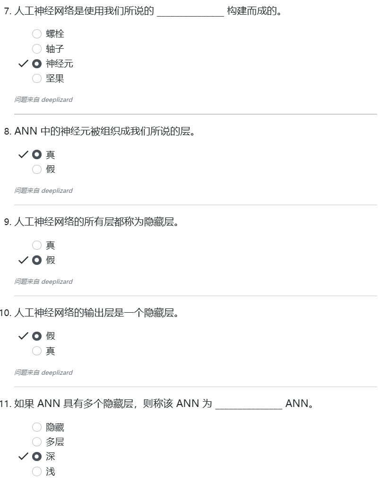

# 解释人工神经网络

## 什么是人工神经网络？

***人工神经网络是一种计算系统，它由一组称为神经元的连接单元组成，这些单元被组织成我们所说的层。***

神经元通常也称为 *节点* （nodes）

节点被组织成我们所说的层。在最高级别，每个 ANN 中有三种类型的层：

1. 输入层	Input layer
2. 隐藏层    Hidden layer==s==
3. 输出层    Output layer

不同的层在输入过程中执行不同类型的转换。

数据从输入层开始流经网络，然后穿过隐藏层，直到到达输出层。这称之为 **通过网络** （ a forward pass through the network）

位于输入和输出图层之间的图层称为隐藏图层。

以下是每种类型的层中包含的节点数：

1. Input layer - 输入数据的每个组成部分对应一个节点
2. Hidden layers - 每个隐藏层的节点数可以任意选择
3. Output layer - 每个可能的期望输出对应一个节点

## 可视化人工神经网络

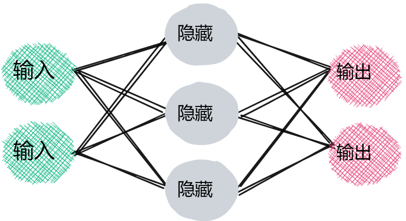

此 ANN 共有 3 层。左侧的图层是输入图层。右侧的图层是输出图层，中间的图层是隐藏图层。请记住，每一层都由神经元或节点组成。此处节点用圆圈表示，那么让我们看看这个网络的每一层中有多少个节点。

每层节点数：

1. 输入层（左）：2 个节点
2. 隐藏层（中间）：3 个节点
3. 输出层（右）：2 个节点

由1.可以看出这个网络的每个输入都必须有两个维度，例如*身高*和*体重*。由3.可以知道通过网络向前传递（从左到右）的每个输入都有两个可能的输出。例如，*超重*或*减重*可以是两个输出类别。请注意，输出类也称为预测类。   

### Keras 顺序模型                                                                                                                                                                                                                                                                                                                                                                                                                                                                                                                                                                                                                                                                                                                                                                                                                                                                                                                                                                                                                                                                                                                                                                                                                                                                                                                                                                                                                                                                                                                                                                                                                                                                                                                                                                                                                                                                                                                                                                                                                                                                                                                                                                                                                                                                                                                                                                                                                                                                                                                                                                                                                                                                                                                                                                                                                                                                                                                                                                                                                                                                                                                                                                                                                                                                                                                                                                                                                                                                                                                                                                                                                                                                                                                                                                                                                                                                                                                                                                                                                                                                                                                                                                                                                                                                                                                                                                                                                                                                                                                                                                                                                                                                                                                                                                                                                                                                                                                                                                                                                                                                                                                                                                                                                                                                                                                                                                                                                                                                                                                                                                                                                                                                                                                                                                                                                                                                                                                                                                                                                                                                                                                                                                                    

在 Keras 中，我们可以构建所谓的顺序模型。Keras 将顺序模型定义为线性层的顺序堆栈。这正是我们所期望的，因为我们刚刚了解到神经元是按层组织的。

这种序列模型是 Keras 对人工神经网络的实现。现在让我们看看如何使用 Keras 构建一个非常简单的序列模型。

首先，我们导入所需的 Keras 类。

```python
from keras.models import Sequential
from keras.layers import Dense, Activation
```

然后，我们创建一个名为 model 的变量，并将其设置为等于一个 Sequential 对象的实例。

```python
model = Sequential(layers)
```

在构造函数中，我们传递了一个 Dense 对象数组。 这些被称为 Dense 的对象实际上都是图层。

```python
layers = [
    Dense(units=3, input_shape=(2,), activation='relu'),
    Dense(units=2, activation='softmax')
]
```

密集一词表示这些层属于密集类型。 密集层是层的一种特殊类型，但还有许多其他类型，我们将在深度学习之旅中继续了解。

## Summary

现在，我们只需了解密集层是 ANN 中最基本的层类型，密集层的每个输出都是通过该层的每个输入计算得出的。
观察图像中（上节）从隐藏层到输出层的箭头，我们可以看到隐藏层中的每个节点都与输出层中的所有节点相连。 因此，我们知道图像中的输出层是一个密集层。 这一逻辑同样适用于隐藏层。
传递给每个层中 Dense 层构造函数的第一个参数会告诉我们它应该有多少个神经元。
输入形状参数 input_shape=(2,) 告诉我们输入层有多少个神经元，因此在我们的例子中，我们有两个神经元。
最后，我们还有一个所谓激活函数的参数。

1. `activation='relu'`
2. `activation='softmax'`

目前我们只需要知道 激活函数是一个非线性函数，通常遵循密集层。

## Quiz

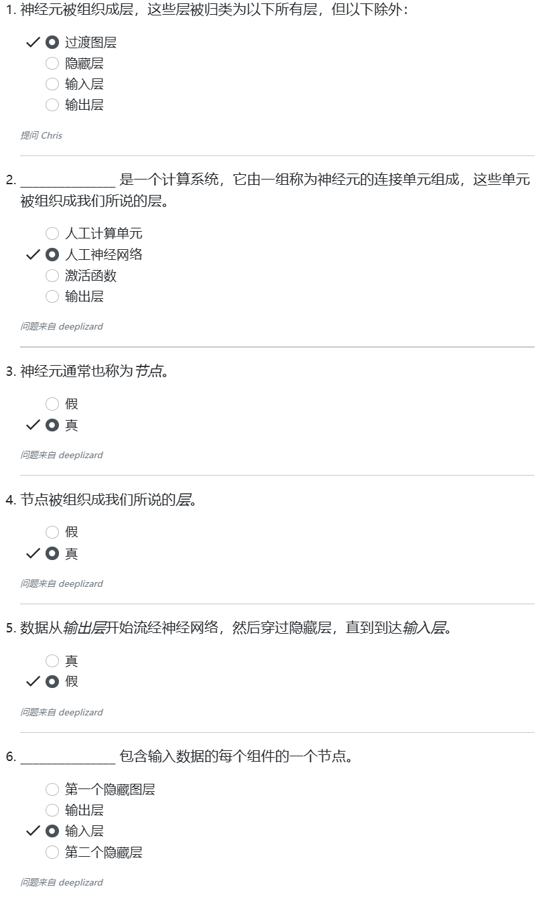

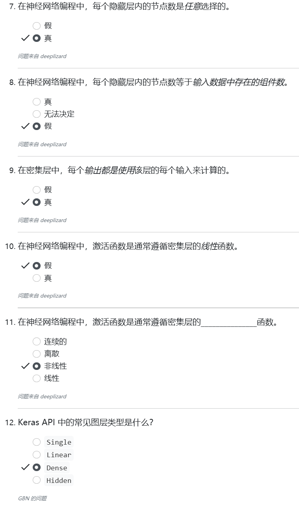


# 解释神经网络中的层

我们查看的示例显示了密集层的使用，这些层也称为全连接层。然而，也有不同的 图层类型。一些示例包括：

- 密集（或完全连接）层（Dense (or fully connected) layers）
- 卷积层（Convolutional layers）
- 池化层（Pooling layers）
- 循环层（Recurrent layers）
- 归一化层（Normalization layers）


## 为什么有不同类型的图层？

不同的层对其输入执行不同的转换，并且某些层比其他层更适合某些任务。

例如，卷积层：通常用于处理图像数据的模型。

​			递归层：用于处理时间序列数据的模型。

​			全连接层，顾名思义，完全连接每个输入 添加到其层中的每个输出中。

## 示例人工神经网络：

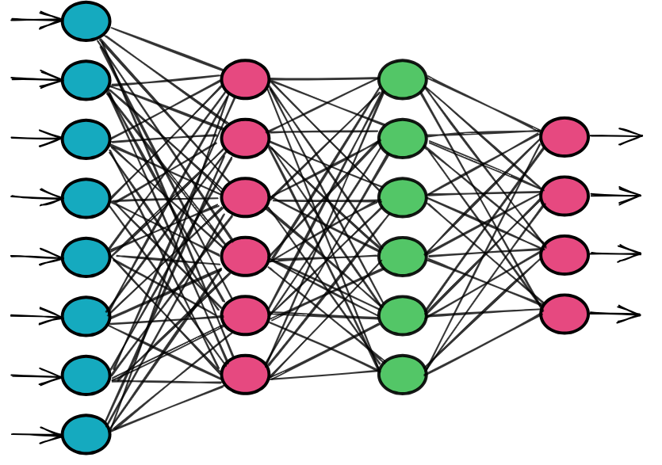

**输入层 8个节点 每个分别代表数据集中给定样本的一个单独特征**

​		这告诉我们：数据集中的单个样本由8个维度组成。

​		当我们从数据集中选择一个样本并将其传递给模型时，样本中包含的八个值中的每一个都将提供给输入层中的一个相应节点。

​		我们可以看到，八个 输入节点中的每一个都连接到下一层中的每个节点。

​		第一层和第二层之间的每个连接都将前一个节点的输出传输到接收节点的输入（从左到右）。中间的两个层各有六个节点，它们是隐藏层，因为它们被定位 在输入和输出层之间。

### 层权重

​		两个节点之间的每个连接都有一个相关的权重，它只是一个数字。

​		每个权重代表两个节点之间连接的强度。当网络在输入层的某个节点接收到输入时，该输入会通过一个连接传递到下一个节点，而该输入会乘以分配给该连接的权重。

​		对于第二层的每个节点，都会计算每个输入连接的<u>加权和</u>。然后将该和传递给激活函数，激活函数会对给定的和进行某种转换。例如，激活函数可将总和转换为介于 0 和 1 之间的数字。实际的变换会根据使用的激活函数而有所不同。下一节将详细介绍激活函数。

**`节点输出 = 激活（输入的加权和）`**

### 神经网络的前向传递 

​		一旦我们获得了某个节点的输出，获得的输出值就会作为输入传递给下一层的节点。 这个过程一直持续到输出层。 **输出层的节点数量取决于可能的输出或预测类别的数量。** 在我们的例子中，我们有四种可能的预测类别。 假设我们的模型的任务是对四种动物进行分类。 输出层的每个节点将代表四种可能性中的一种。 例如，我们可以选择猫、狗、骆驼或蜥蜴。 **对于数据集中的给定样本，从输入层到输出层的整个过程称为网络的前向传递。**

### 找到最佳权重

​		随着模型的学习，所有连接的权重都会得到更新和优化，从而使输入数据点映射到正确的输出预测类别。随着我们对深度学习的深入，我们将进一步了解这一优化过程。

​		这让我们对 ANN 内部各层是如何工作的有了一个大致的入门了解。现在让我们看看如何使用 Keras 中的代码来表达我们的模型。

## 使用 Keras 在代码中定义神经网络

​		在前面的讨论中，我们了解了如何使用 Keras 构建顺序模型。现在，让我们为我们的示例网络做这件事。

​		首先，我们将定义一个 Dense 对象列表，即我们的层。然后将此列表传递给顺序模型的构造函数。

请记住，我们的网络看起来是这样的


鉴于此，我们有：

```python
layers = [
    Dense(units=6, input_shape=(8,), activation='relu'),
    Dense(units=6, activation='relu'),
    Dense(units=4, activation='softmax')
]
```

​		请注意，列表中指定的第一个 Dense 对象并不是输入层。第一个 Dense 对象是第一个隐藏层。<u>输入层被指定为第一个 Dense 对象构造函数的参数。</u>

​		我们的输入形状是 8。这就是为什么我们的输入形状被指定为 input_shape=(8,)。我们的第一个隐藏层有六个节点，第二个隐藏层也是如此，输出层有四个节点。

​		现在，只需注意我们在两个隐藏层中都使用了名为 relu 的激活函数activation='relu' ，在输出层中使用了名为 softmax 的激活函数activation='softmax' 。我们将在下一篇关于激活函数的文章中详细介绍这些函数。

我们的最终产品看起来是这样的

```python
from keras.models import Sequential
from keras.layers import Dense, Activation

layers = [
    Dense(units=6, input_shape=(8,), activation='relu'),
    Dense(units=6, activation='relu'),
    Dense(units=4, activation='softmax')
]

model = Sequential(layers)
```

这就是使用 Keras 在代码中表达我们的模型的方式。

## Quiz

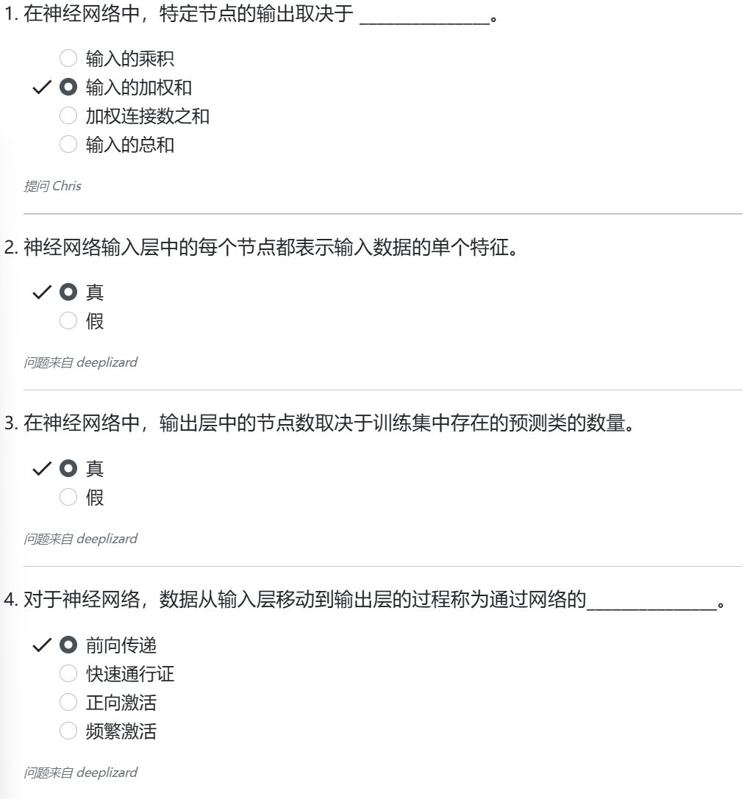

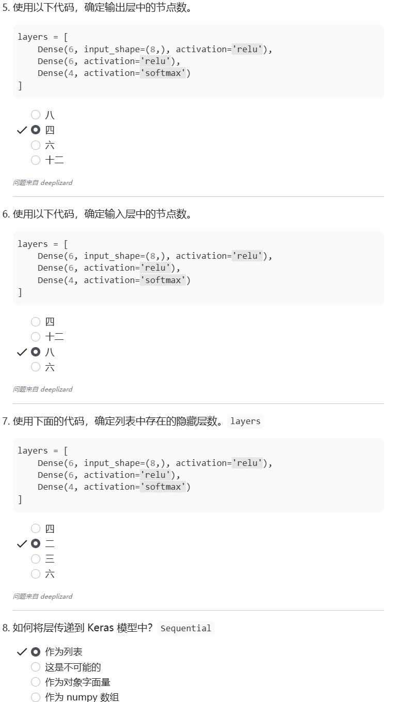

# 解释神经网络中的激活函数

## 什么是激活函数？

**Definition：**

​		**在人工神经网络中，激活函数是将节点的输入映射到其相应输出的函数。**

我们获取层中每个节点的每个传入连接的加权和，并将该加权和传递给激活函数。

​		**==激活函数会进行某种运算，将总和转换为一个数字，这个数字通常介于某个下限和某个上限之间。这种变换通常是非线性变换。==**


## 激活函数有什么作用？

激活函数转换是怎么回事？直觉是什么？为了解释这个问题，我们先来看一些激活函数的例子。

### Sigmoid 激活函数

Sigmoid 接收一个输入，并执行以下操作：
		对于大多数负输入，sigmoid 会将输入转化为一个非常接近
0的数字。对于大多数正输入，sigmoid 会将输入转化为一个非常接近
1的数字。对于相对接近0的输入，sigmoid 会将输入转换成介于0和1
之间的某个数字。
在数学上，我们可以写成

​									$$sigmoid（x）=\frac{e^{x}}{e^{x}+1}$$

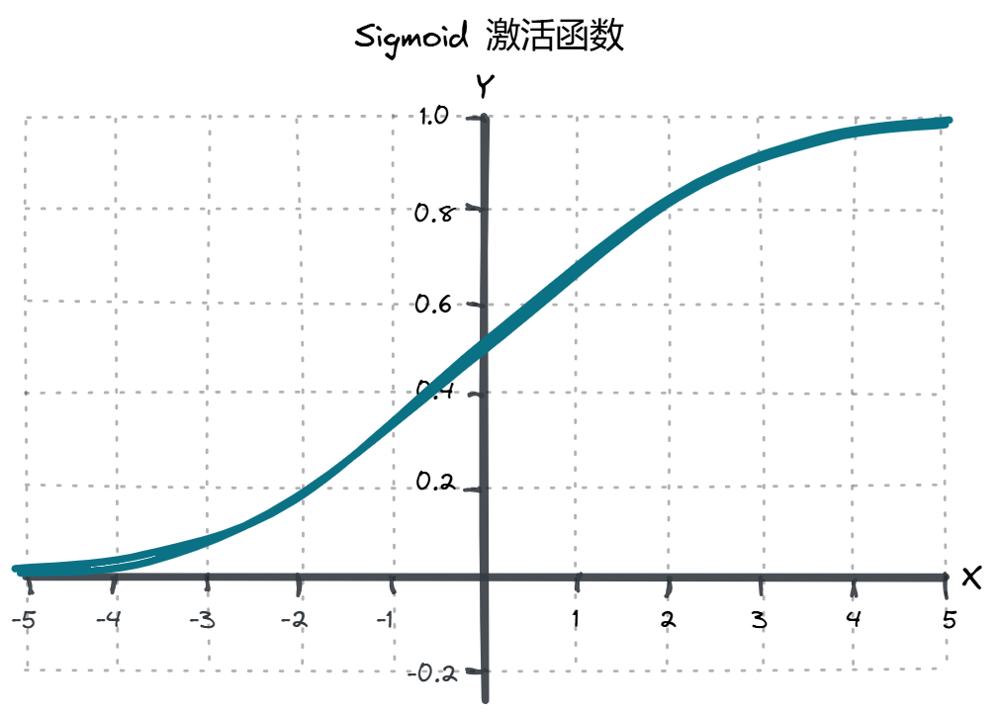

因此，对于sigmoid激活函数，0是下限，1是上限。

以上是从数学上理解激活函数的作用，接着我们来看从直觉上理解激活函数的作用。

### 激活函数的直觉

​		首先，激活函数的生物学灵感来自于我们大脑中的活动，不同的刺激会激发（或激活）不同的神经元。

例如，如果你闻到令人愉悦的气味，如新鲜出炉的饼干，大脑中的某些神经元就会启动并被激活。如果你闻到不愉快的气味，比如变质的牛奶，就会导致大脑中的其他神经元发射。

​		在我们大脑的褶皱深处，某些神经元要么启动，要么不启动。这可以用 0 表示不启动，或者用 1 表示启动。

```python
// pseudocode
if (smell.isPleasant()) {
    neuron.fire();
}
```

通过人工神经网络中的 Sigmoid 激活函数，我们可以看到，<u>神经元可以介于 0 和 1 之间，越接近1，神经元的激活程度就越高，而越接近0，神经元的激活程度就越低。</u>

### Relu 激活函数

现在，我们的激活函数并不总是要对输入进行转换，使其介于 0 和 1
之间。事实上，当今最广泛使用的激活函数之一 ReLU 就没有这样做。ReLU 是整型线性单元的简称，它将输入转化为 0 或输入本身的最大值。

​									 $relu(x)=max(0，x)$ 

因此，如果输入值小于或等于 0 ，那么 relu 将输出 0 。如果输入值大于或等于 0 ，那么 relu 将只输出给定的输入值。

```python
// pseudocode
function relu(x) {
    if (x <= 0) {
        return 0;
    } else {
        return x;
    }
}
```

这里的意思是，神经元的正向性越强，它就越被激活。现在，我们只讨论了两个激活函数，即 sigmoid 和 relu，但还有其他类型的激活函数会对输入进行不同类型的转换。

## 我们为什么要使用激活函数？

要理解我们为什么使用激活函数，我们首先需要了解线性函数。

假设 $f$ 在集合 $X$ 中

假设 $a$ 和 $b$ 在集合 $X$ 中

假设 $x$ 是一个实数

当且仅当满足以下条件时，$f$ 才能被称作线性函数

​	$f(a+b) = f(a) + f(b)$            $f(xa) = xf(a)$          			

线性函数的一个重要特征是，**两个线性函数的组合也是一个线性函数**。这意味着，<u>即使在深度神经网络中，如果我们在前向传递过程中只对数据值进行线性变换，那么网络中从输入到输出的学习映射也将是线性的。</u>

通常情况下，我们希望<u>通过深度神经网络学习的映射类型比简单的线性映射更为复杂。</u>

这就是激活函数的作用所在。大多数激活函数都是非线性的，而且是有意选择的。**非线性激活函数允许我们的神经网络计算任意复杂的函数。**

#### 证明 Relu 是非线性的

要证明 relu 激活函数是非线性的，需证明 relu 不是线性的

证明如下：

​		对于每一个实数 $x$ ，我们定义一个函数 $f$ 如下：

​									 $f(x) = relu(x)$ 

​		假设 $a$ 是一个小于 0 的实数，则：

 $f(-1a) = max(0,-1a)>0$  而  $(-1)f(a) = (-1)max(0,a) = 0$ 

​		因此：

​								 $f(-1a) \ne (-1)f(a)$ 

故，函数 $f$ 不是线性的。


## 使用 Keras在代码中指定激活函数 

实现这一点有两种基本方法。

第一种方法：首先，我们将导入我们的类。

```python
from keras.models import Sequential
from keras.layers import Dense, Activation
```

现在，指定激活函数的第一种方法是在层的构造函数中这样做：

```python
model = Sequential([
    Dense(units=5, input_shape=(3,), activation='relu')
])
```

在本例中，我们有一个 Dense 层，并指定 relu 作为我们的激活函数 

function `activation='relu'`.

第二种方法：在模型实例化后将层和激活函数添加到模型中，例如：

```python
model = Sequential()
model.add(Dense(units=5, input_shape=(3,)))
model.add(Activation('relu'))
```

请记住：

​							**节点输出 = 激活（输入加权和）**
对于我们的示例，这意味着 Dense 层中节点的每个输出都将等于加权和的 relu 结果，如

​							<u>节点输出 = relu（输入加权总和）</u>

## Quiz

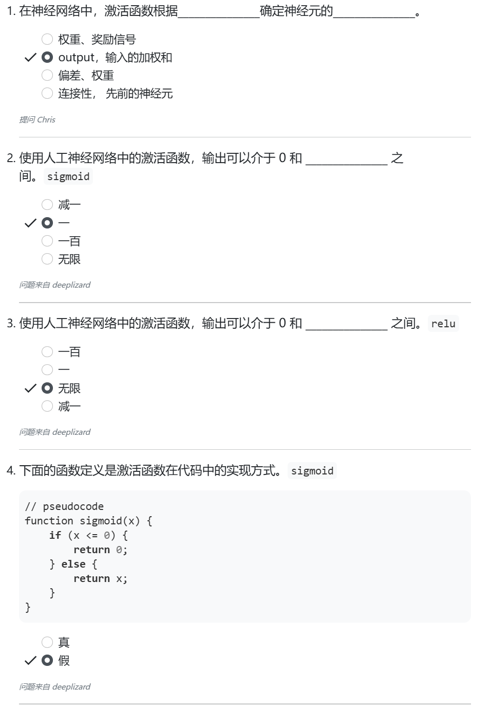

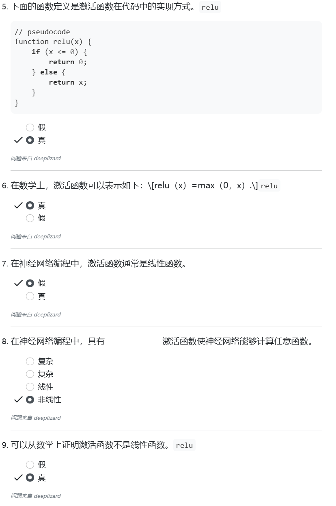


# 解释训练神经网络

## 训练人工神经网络

### 什么是训练

​		当我们训练一个模型时，基本上是在试图解决一个优化问题。我们试图优化模型中的权重。我们的任务是<u>找到最准确地将输入数据映射到正确输出类别的权重</u>。这种映射是网络必须学习的。

​		回想一下，我们在关于层的文章中提到过这个想法。在那篇文章中，我们展示了节点之间的每个连接是如何分配任意权重的。在训练过程中，这些权重会反复更新，并向其最佳值移动。

```python
// pseudocode
def train(model):
    model.weights.update()
```

#### 优化算法（Optimization Algorithm）

​		权重的优化采用我们所说的优化算法。优化过程取决于所选的优化算法。我们也用优化器来指代所选的算法。最广为人知的优化算法是  <u>*随机梯度下降算法*（*stochastic gradient descent*）</u>，更简单地说，就是 **SGD** 。

​		当我们遇到任何优化问题时，都必须有一个优化目标，所以现在让我们来考虑一下 <u>SGD 在优化模型权重时的目标</u>是什么。

​		**SGD 的目标是最小化某个给定函数** ，我们称之为**损失函数**。因此，SGD 更新模型权重的方式是使这个损失函数尽可能接近其最小值。

#### 损失函数（Loss Function）

​		常见的损失函数之一是 ***均方误差*（*mean squared error* ）（MSE）** ，但我们也可以使用多种损失函数来代替它。决定使用哪个损失函数更好，是深度学习的工作之一。现在，我们只考虑一般的损失函数，稍后我们将更详细地了解具体的损失函数。

​		什么是 <u>实际损失</u> 呢？在训练过程中，我们会为模型提供数据和与数据相对应的标签。

例如，假设我们有一个模型，我们想训练它对图像进行分类，看看是猫的图像还是狗的图像。我们将为模型提供猫和狗的图像，以及这些图像的标签，说明每张图像是猫还是狗。

假设我们给模型提供了一张猫的图像。一旦前向传递完成，猫图像数据流经网络，模型将在最后提供一个输出。这将包括模型所认为的图像，要么是猫，要么是狗。

从字面意义上讲，输出将包括猫或狗的概率。例如，它可能分配 75% 的概率给图像是猫，25% 的概率给图像是狗。在这种情况下， <u>模型认为图像是猫的可能性要高于是狗的可能性</u> 。

- 75%的可能性是猫
- 25%的可能性是狗

我们可以联想到：这与人类做决定的方式非常相似——一切都是预测！

​		**损失是网络对图像的预测与图像真实标签之间的误差或差异** ，SGD 将尽量减少这一误差，使我们的模型预测尽可能准确。

​		将所有数据传递给模型后，我们将继续重复传递相同的数据。 **这种通过网络重复发送相同数据的过程被视为训练** 。在这个训练过程中，模型将进行实际学习。因此，<u>通过 SGD 迭代发生的这一过程，模型能够从数据中学习</u>。


## 总结

​		我们现在大致知道了数据在网络中的一次前向传递过程中发生了什么。在下一篇文章中，我们将了解模型是如何通过多次前向传递数据来学习的，以及 **SGD 究竟是如何最小化损失函数的** 。

​		这篇文章 ==我们总体上涵盖了一些新概念，比如优化器、损失和其他一些概念== 。


## Quiz

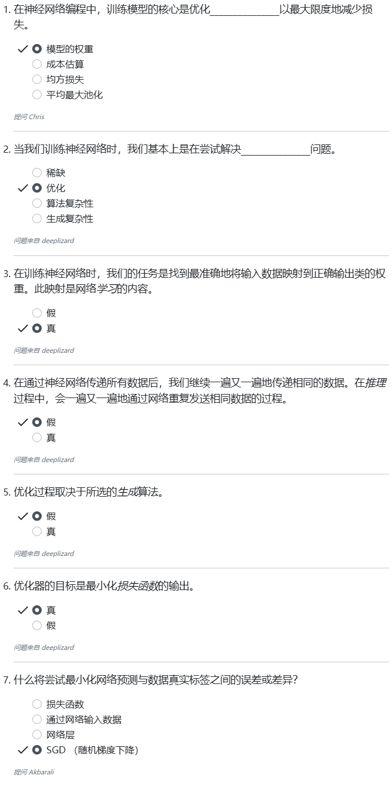


# 解释神经网络如何学习

## 在人工神经网络中学习